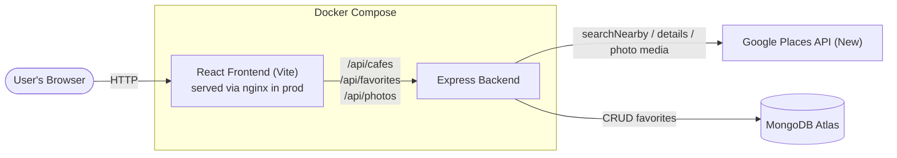

# ☕ CafeMaps

A full-stack web app that discovers nearby cafes in real time using the Google Places API, displays them on an interactive map with rating badges, and lets you save favorites — persisted in MongoDB.


---

## Features

- 📍 **Geolocation search** — find cafes near your current location, or click anywhere on the map to search that spot instead
- 🗺️ **Interactive map** — custom pin markers showing live ratings, a search-radius circle, and click-to-select syncing between the map and the results list
- ⭐ **Filtering** — filter results by name and minimum rating, live
- 📏 **Distance-based sorting** — results ranked by actual distance (Haversine formula) from the search point, with an adjustable radius (1–5 km)
- 🧠 **Cafe-type filtering** — cross-checks Google's `primaryType`/`types` fields to exclude restaurants, bars, and fast food that Google sometimes co-tags as "cafe"
- ❤️ **Favorites** — save/unsave cafes, persisted server-side in MongoDB (not just local storage)
- 🖼️ **Photo proxying** — cafe photos are served through the backend, keeping the Google API key server-side only
- 🎨 **Custom UI** — built with Tailwind CSS + Lucide icons, not a template
- 🐳 **Dockerized** — runs identically via `npm run dev` or `docker compose up`

---

## Tech stack

| Layer | Technology |
|---|---|
| Frontend | React (Vite), Tailwind CSS, React-Leaflet, Lucide icons |
| Backend | Node.js, Express |
| Database | MongoDB (Atlas) |
| External API | Google Places API (New) |
| Containerization | Docker, Docker Compose (multi-stage build for the client) |
| Map tiles | OpenStreetMap via Leaflet |

---

## Architecture



**Why this shape:**
- The frontend never talks to Google directly — the API key lives only on the server, in an environment variable, never shipped to the browser.
- Photos are proxied through `/api/photos` for the same reason: some Google photo endpoints require the key at request time, which would otherwise force the key into client-side code.
- MongoDB stores only favorites (not cafe data itself) — cafe data is always fetched fresh from Google, since caching it long-term would go stale (hours, ratings, etc. change).

---

## Project structure

```
cafe-finder/
├── client/                  # React + Vite frontend
│   ├── src/
│   │   ├── components/      # CafeCard, CafeList, CafeMap, SearchBar, FavoritesList
│   │   ├── hooks/           # useGeolocation
│   │   ├── api.js           # fetch wrapper for backend calls
│   │   └── App.jsx
│   ├── Dockerfile           # multi-stage: build with Vite, serve with nginx
│   └── nginx.conf
├── server/                  # Express backend
│   ├── routes/               places.js, favorites.js, photos.js
│   ├── controllers/
│   ├── services/              placesApi.js (Google Places wrapper)
│   ├── models/                Favorite.js (Mongoose schema)
│   ├── middleware/            errorHandler.js
│   ├── Dockerfile
│   └── server.js
├── docker-compose.yml
└── README.md
```

---

## Getting started (local, without Docker)

### 1. Prerequisites
- Node.js 20+
- A Google Cloud project with **Places API (New)** enabled
- A MongoDB Atlas cluster (free tier is fine)

### 2. Clone and configure
```bash
git clone https://github.com/<yaeshni>/cafeMaps.git
cd cafeMaps
```

Backend:
```bash
cd server
cp .env.example .env
# fill in GOOGLE_PLACES_API_KEY and MONGO_URI in .env
npm install
```

Frontend:
```bash
cd ../client
cp .env.example .env
npm install
```

### 3. Run it (two terminals)
```bash
# Terminal 1
cd server && npm run dev

# Terminal 2
cd client && npm run dev
```
Open `http://localhost:5173`.

---

## Getting started (with Docker)

```bash
docker compose up --build
```
Open `http://localhost:5173`. The client is served by nginx (production-style build), the server runs the same Express app, and both talk to the same MongoDB Atlas + Google Places API as the non-Docker setup — only your `server/.env` is required (no local Mongo container needed, since Atlas is cloud-hosted).

Stop with:
```bash
docker compose down
```

---

## API endpoints (backend)

| Method | Route | Description |
|---|---|---|
| GET | `/api/cafes?lat=&lng=&radius=` | Nearby cafe search |
| GET | `/api/cafes/:placeId` | Full details for one cafe |
| GET | `/api/photos?name=&maxWidth=` | Proxies a Google Places photo |
| GET | `/api/favorites` | List saved favorites |
| POST | `/api/favorites` | Save a favorite |
| DELETE | `/api/favorites/:placeId` | Remove a favorite |

---

## Known limitations

- **Category accuracy depends on Google's own data.** Small businesses (especially in smaller towns) sometimes self-tag their Google Business listing as "cafe" even when they're a motel, electronics shop, or juice stall. The app filters on `primaryType`/`types`, which correctly reflects what's *tagged* — but tagging quality itself varies by region. Results are noticeably cleaner in metro areas with denser, better-maintained Places data.
- **Photo coverage is sparse in smaller towns**, for the same reason — many listings simply have no photos uploaded to Google at all. The app gracefully falls back to a placeholder icon rather than a broken image.
- No user accounts yet — favorites are global rather than per-user (see Future Improvements).
- Manual address search (typing a place name instead of clicking the map) isn't implemented yet — would require the Google Geocoding API.

---

## Future improvements

- Per-user accounts with JWT auth, so favorites are personal rather than global
- Manual address/city search via Google Geocoding API
- Response caching to reduce repeat Google API calls
- Basic rate limiting on the backend
- Deployed CI/CD pipeline

---

## Author

Built by Aeshni — [GitHub](#) · [LinkedIn](#)
